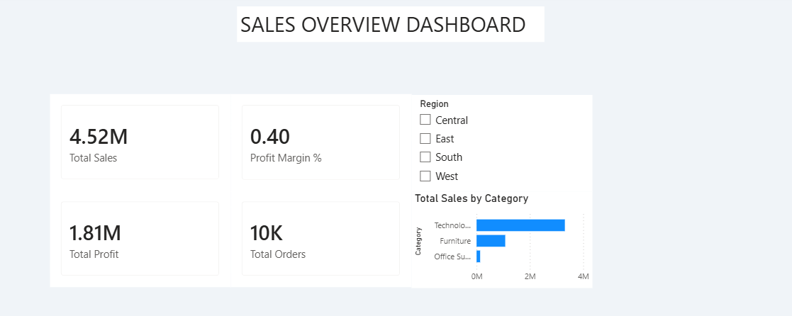
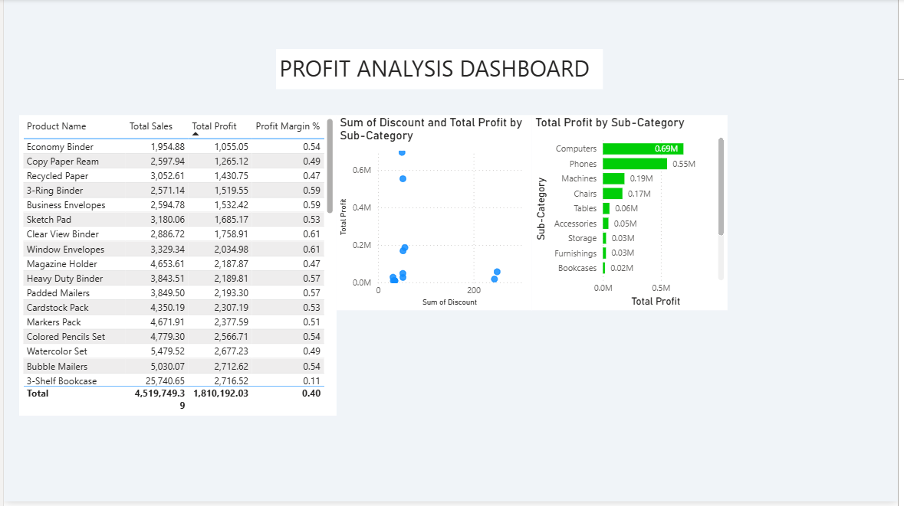
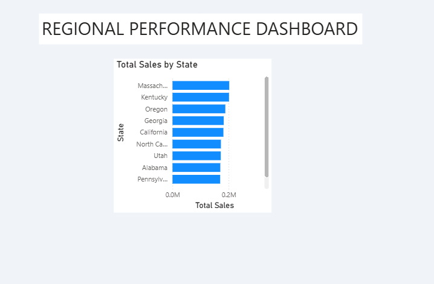
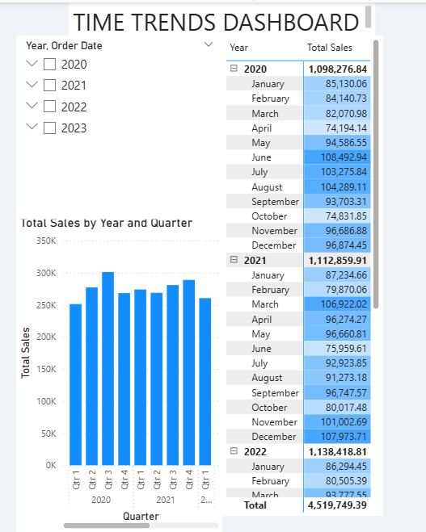

<div align="center">

<!-- ANIMATED HEADER BANNER -->


<!-- BADGES ROW 1 -->
<p>
  
  
  
  
</p>

<!-- BADGES ROW 2 -->
<p>
  
  
  
  
  
</p>

<br/>

> ### 📊 Transforming 9,994 raw retail transactions into actionable business intelligence
> *An end-to-end Power BI dashboard uncovering $2.3M in sales insights, profit leakages, and regional performance trends*

<br/>

</div>

---

## 📸 Dashboard Preview

<div align="center">

| 🏠 Sales Overview | 💰 Profit Analysis |
|:-:|:-:|
|  |  |

| 🗺️ Regional Performance | 📅 Time Trends |
|:-:|:-:|
|  |  |

</div>

> 💡 *Replace the image placeholders above with actual screenshots of your Power BI dashboard*

---

## 🎯 Project Objective

This project presents a **complete Business Intelligence solution** for a fictional US-based retail company using the Sample Superstore dataset. The goal is to transform raw transactional data into a multi-page interactive Power BI dashboard that helps business stakeholders answer critical questions about **revenue, profitability, regional performance, and seasonal trends**.

---

## 🗂️ Repository Structure

```
📁 superstore-powerbi-analysis/
│
├── 📊  Superstore_Sales_Analysis.pbix     ← Main Power BI Report File
│
├── 📁  dataset/
│     └── 📄 Sample_Superstore.xlsx        ← Source Dataset (9,994 rows)
│
├── 📁  screenshots/
│     ├── 🖼️  dashboard_overview.png       ← Page 1: Sales Overview
│     ├── 🖼️  dashboard_profit.png         ← Page 2: Profit Analysis
│     ├── 🖼️  dashboard_region.png         ← Page 3: Regional Performance
│     └── 🖼️  dashboard_trends.png         ← Page 4: Time Trends
│
├── 📄  DAX_Measures.md                    ← All DAX formulas documented
├── 📄  Project_Report.md                  ← Full written project report
├── 📄  Project_Presentation.pptx          ← 8-slide project presentation
└── 📄  README.md                          ← You are here!
```

---

## 🛠️ Tech Stack

<div align="center">

| Tool | Purpose | Version |
|:--|:--|:--|
|  | Dashboard creation & visualization | Latest |
|  | Data cleaning & transformation (M Language) | Built-in |
|  | Custom KPI & measure calculations | Built-in |
|  | Source data format | .xlsx |

</div>

---

## 📂 Dataset Overview

<div align="center">

| Attribute | Details |
|:--|:--|
| 📦 **Source** | Sample Superstore (classic BI practice dataset) |
| 📋 **Total Records** | 9,994 orders |
| 📐 **Columns** | 21 fields |
| 📅 **Date Range** | January 2020 – December 2023 |
| 🗺️ **Geography** | United States — 4 Regions, 49 States |
| 👥 **Segments** | Consumer, Corporate, Home Office |
| 🏷️ **Categories** | Technology, Furniture, Office Supplies |

</div>

### Key Columns Used:
`Order ID` • `Order Date` • `Ship Date` • `Customer Name` • `Segment` • `Region` • `State` • `Category` • `Sub-Category` • `Product Name` • `Sales` • `Quantity` • `Discount` • `Profit`

---

## 📊 Dashboard Pages

<details>
<summary><b>📄 Page 1 — Sales Overview</b> (click to expand)</summary>
<br/>

| Visual | Type | Fields Used |
|:--|:--|:--|
| Total Sales | KPI Card | `[Total Sales]` |
| Total Profit | KPI Card | `[Total Profit]` |
| Total Orders | KPI Card | `[Total Orders]` |
| Profit Margin | KPI Card | `[Profit Margin %]` |
| Sales by Category | Clustered Bar Chart | `Category` × `[Total Sales]` |
| Monthly Sales Trend | Line Chart | `Order Date (Month)` × `[Total Sales]` |
| Region Filter | Slicer | `Region` |

</details>

<details>
<summary><b>📄 Page 2 — Profit Analysis</b> (click to expand)</summary>
<br/>

| Visual | Type | Fields Used |
|:--|:--|:--|
| Profit by Sub-Category | Bar Chart (conditional format) | `Sub-Category` × `[Total Profit]` |
| Discount vs Profit | Scatter Chart | `Discount` × `[Total Profit]` |
| Top 10 Products | Table | `Product Name`, `Sales`, `Profit`, `Margin %` |

</details>

<details>
<summary><b>📄 Page 3 — Regional Performance</b> (click to expand)</summary>
<br/>

| Visual | Type | Fields Used |
|:--|:--|:--|
| Top 10 States by Sales | Bar Chart (Top N Filter) | `State` × `[Total Sales]` |
| Region Summary | Table | `Region`, `Sales`, `Profit`, `Orders` |
| Segment Filter | Slicer | `Segment` |

</details>

<details>
<summary><b>📄 Page 4 — Time Trends</b> (click to expand)</summary>
<br/>

| Visual | Type | Fields Used |
|:--|:--|:--|
| Year Filter | Slicer | `Order Date (Year)` |
| Sales by Quarter | Column Chart | `Order Date (Quarter)` × `[Total Sales]` |
| Monthly Heat Map | Matrix | `Year` × `Month` × `[Total Sales]` |

</details>

---

## 🔢 Key DAX Measures

```dax
// ── Core Sales Measures ──────────────────────────────────────
Total Sales = SUM(Orders[Sales])

Total Profit = SUM(Orders[Profit])

Total Orders = DISTINCTCOUNT(Orders[Order ID])

// ── Profitability ────────────────────────────────────────────
Profit Margin % = DIVIDE([Total Profit], [Total Sales], 0)

Avg Order Value = AVERAGE(Orders[Sales])

// ── Time Intelligence ────────────────────────────────────────
YoY Growth % =
DIVIDE(
    [Total Sales] - CALCULATE([Total Sales], SAMEPERIODLASTYEAR('Date'[Date])),
    CALCULATE([Total Sales], SAMEPERIODLASTYEAR('Date'[Date])),
    0
)

YTD Sales = TOTALYTD([Total Sales], 'Date'[Date])
```

> 📄 See [`DAX_Measures.md`](DAX_Measures.md) for the full list of all 20+ measures with explanations.

---

## 💡 Key Insights Discovered

<div align="center">

| # | Insight | Finding |
|:-:|:--|:--|
| 📈 | **Technology Leads Revenue** | Contributes **36% of total sales** ($830K). Phones & Computers are top sub-categories. |
| 🌍 | **West Region is #1 Market** | Generates **$725K (32%)** of revenue. California alone = 19% of all sales. |
| ⚠️ | **Furniture Has Negative Profit** | Tables & Bookcases operate at a **net loss** due to excessive discounting (28–35%). |
| 👤 | **Corporate = Highest Profit/Order** | Corporate segment earns **33% more profit per order** than Consumer segment. |
| 📅 | **Q4 is Peak Season** | November & December = **30% of annual revenue**. Critical window for campaigns. |
| 🎯 | **Discounts Kill Margins** | Orders with >20% discount average **–3.8% profit margin** vs +18.2% without discount. |

</div>

---

## ✅ Skills Demonstrated

<div align="center">

| Skill Area | What Was Done |
|:--|:--|
| 🔄 **Power Query (M)** | Data cleaning, type conversion, column splitting, duplicate removal |
| 📐 **DAX Formulas** | SUM, DIVIDE, CALCULATE, SAMEPERIODLASTYEAR, TOTALYTD, RANKX |
| 🗃️ **Data Modeling** | Star schema design, table relationships, calculated columns |
| 📊 **Data Visualization** | Bar, Line, Scatter, Matrix, KPI Cards, Slicers, Conditional Formatting |
| 🧠 **Business Analysis** | Insight generation, trend analysis, profitability diagnosis |
| 🎨 **Dashboard Design** | Multi-page layout, consistent theming, drill-through, cross-filtering |

</div>

---

## 🚀 How to Open This Project

```bash
# Step 1 — Download Power BI Desktop (free)
# https://powerbi.microsoft.com/desktop/

# Step 2 — Clone this repository
git clone https://github.com/yourusername/superstore-powerbi-analysis.git

# Step 3 — Open the .pbix file
# Double-click Superstore_Sales_Analysis.pbix
# OR open Power BI Desktop → File → Open → select the file

# Step 4 — If prompted for data source
# Point it to: dataset/Sample_Superstore.xlsx
```

> ✅ **No coding required** — just Power BI Desktop (free download from Microsoft)

---

## 📈 Business Recommendations

Based on the dashboard analysis, the following actions are recommended:

- 🚫 **Cap discounts at 15%** across all categories to protect profit margins
- 🎯 **Focus on Corporate segment** — higher profit per order, better upsell potential
- 📦 **Review Furniture pricing** — Tables and Bookcases are losing money
- 🌎 **Invest more in West Region** — already the top performer, higher ROI
- 🛒 **Plan Q4 campaigns early** — 30% of annual revenue happens in Nov–Dec
- 💻 **Double down on Technology** — best margins and highest average order value

---

## 👨‍💻 About the Author

<div align="center">

**Anantha Mukesh Paandithevan**
<br/>
🎓 Bachelor of Computer Science (Data Science)
<br/><br/>

[](https://www.linkedin.com/in/anantha-mukesh-paandithevan-91bb993a5?utm_source=share_via&utm_content=profile&utm_medium=member_ios)
[](https://github.com/Mukeshh27)
[](mailto:anantha2706@gmail.com)

</div>

---

## 📄 License

This project is licensed under the **MIT License** — feel free to use it as a reference for your own learning!

---

<div align="center">


**⭐ If this project helped you, please consider giving it a star! It means a lot ⭐**

*Made with ❤️ by Anantha Mukesh Paandithevan*

</div>
